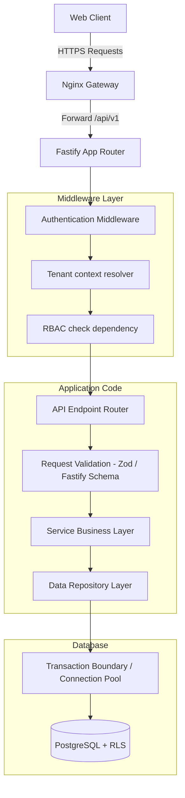

# API Architecture & Integration Model

This document outlines the API layer architecture for the **Restaurant OS** platform. It defines the flow of HTTP requests, responsibilities of each software tier, and the standardized structure of client-server communication.

---

## 1. Request Lifecycle Flow

Every request directed to the system traverses a standardized path to enforce security, tenancy rules, and relational transactions.



### Layer Responsibilities

1. **Nginx Reverse Proxy:** Terminates TLS/SSL, manages CORS policy limits, checks basic request size boundaries (max 2MB), and serves static React assets.
2. **Fastify Router:** Routes inbound HTTP endpoints, parses path/query parameters, and coordinates middleware/hook execution.
3. **Authentication Middleware:** Extracts server-side session IDs from secure cookies, validates them against the active cache, and identifies the core user.
4. **Tenant Context Resolver:** Looks up `restaurant_memberships` and `user_roles` to extract the user's tenant ID, active location ID, and active roles. Sets these parameters in request state.
5. **RBAC Dependency:** Verifies the user's role has the required permission tags (e.g. `order:create`) before invoking application code.
6. **Request Validation (Zod / Fastify Schema):** Parses the JSON payload, validating constraints (e.g., non-empty strings, numeric ranges, valid UUID formats) and throwing HTTP 422 if invalid.
7. **Service Layer:** Houses the core business logic. Coordinates complex multi-table mutations, ledger rules, and dispatches real-time event alerts. This layer is decoupled from web framework classes.
8. **Repository Layer:** Abstracted data-access layer using `pg` driver to handle queries. Executes within a transaction block `BEGIN` where `SET LOCAL app.current_tenant_id` and `SET LOCAL app.current_location_id` are initialized for Row Level Security.

---

## 2. API Response Standard

All API endpoints must return structured JSON envelopes.

### A. Success Envelope (HTTP 200, 201)
```json
{
  "success": true,
  "data": {},
  "message": "Operation completed successfully",
  "meta": null
}
```
*Note: For paginated responses, `meta` carries pagination metrics (`total_count`, `limit`, `offset`, `total_pages`).*

### B. Error Envelope (HTTP 4xx, 5xx)
```json
{
  "success": false,
  "data": null,
  "error": {
    "code": "ERROR_CODE_STRING",
    "message": "Human readable error description",
    "details": {}
  }
}
```

---

## 3. Standard HTTP Status Codes

- **200 OK:** Request completed successfully, returning payloads.
- **201 Created:** Resource successfully generated (e.g., order created, KOT generated).
- **204 No Content:** Request completed successfully without returning payload data (e.g. logout).
- **400 Bad Request:** Malformed payload structure, unparseable JSON.
- **401 Unauthorized:** Invalid, expired, or missing authentication session cookie.
- **403 Forbidden:** Authenticated user lacks permission to invoke the endpoint (RBAC check failure).
- **404 Not Found:** Resource does not exist, OR belongs to another tenant/location (intentionally hidden to prevent ID enumeration).
- **409 Conflict:** Business rule violation (e.g., paying a bill that is already closed, duplicate GRN number).
- **422 Unprocessable Entity:** Payload schema validation failure (Zod / Fastify Schema).
- **429 Too Many Requests:** Rate limit exceeded.
- **500 Internal Server Error:** Unexpected database or application failure.

---

## 4. API Versioning & Deprecation

- **Version Scope:** All production APIs are prefixed with `/api/v1`.
- **Breaking Changes:** If schemas or endpoints undergo backward-incompatible modifications, they are implemented under a new router namespace `/api/v2`.
- **Coexistence:** The server runs both `/v1` and `/v2` concurrently, preventing client application crashes during staggered updates.
