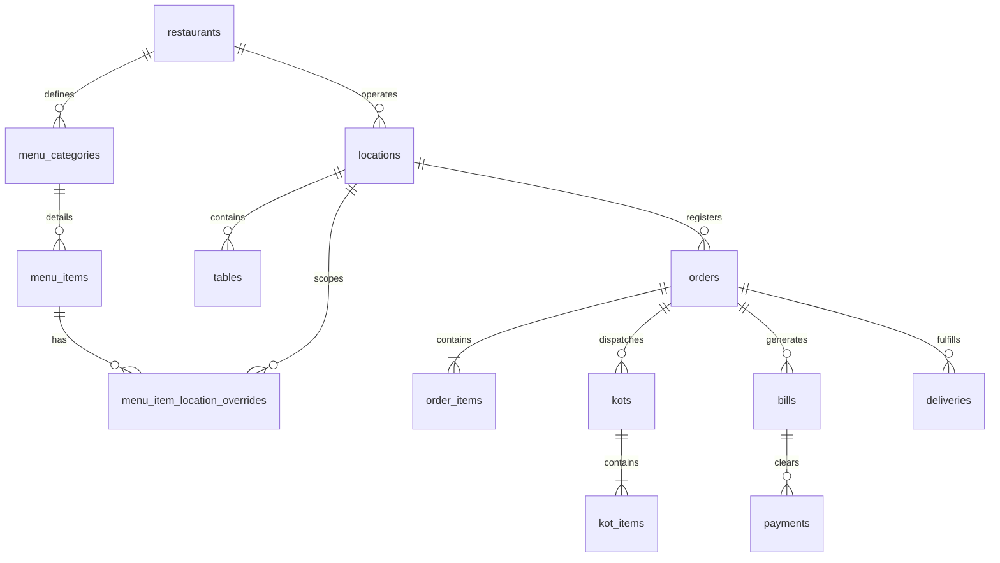

# Database Design & Schema Specification (Multi-Tenant Reconciled)

This document outlines the PostgreSQL database schema for the **Restaurant Management System (Restaurant OS)**. The design transitions the transient, client-side Redux states into structured, normalized, and ACID-compliant relational tables.

---

## 1. Global Field Standards

- **ID Columns:** All tables use UUID (v4) strings as primary keys (`UUID` datatype in PostgreSQL) for secure distributed key generation.
- **Auditing Columns:** Every table includes:
  - `created_at TIMESTAMP WITH TIME ZONE DEFAULT CURRENT_TIMESTAMP`
  - `updated_at TIMESTAMP WITH TIME ZONE DEFAULT CURRENT_TIMESTAMP`
  - `deleted_at TIMESTAMP WITH TIME ZONE` (for soft-deleted resources such as menu items, users, and tables).
- **Tenant Scope Isolation:** Multitenant tables must include:
  - `restaurant_id` UUID REFERENCES restaurants(id) ON DELETE CASCADE
  - `location_id` UUID REFERENCES locations(id) ON DELETE CASCADE (except for restaurant-wide entities like master menu items, master categories, etc.)

---

## 2. Entity Domains & Schema Definition

### Domain A: AUTHENTICATION & USER MANAGEMENT

#### `users`
- **Purpose:** Registers system staff and global platform credentials.
- `id` UUID PRIMARY KEY
- `name` VARCHAR(100) NOT NULL
- `username` VARCHAR(50) NOT NULL UNIQUE
- `password_hash` VARCHAR(255) NOT NULL (Argon2id hash)
- `phone` VARCHAR(15)
- `status` VARCHAR(20) DEFAULT 'ACTIVE' (Check: `ACTIVE`, `INACTIVE`)
- *Index:* `idx_users_username`

#### `restaurant_memberships`
- **Purpose:** Links users to specific tenants/restaurants.
- `id` UUID PRIMARY KEY
- `user_id` UUID REFERENCES users(id) ON DELETE CASCADE
- `restaurant_id` UUID REFERENCES restaurants(id) ON DELETE CASCADE
- `status` VARCHAR(20) DEFAULT 'ACTIVE' (Check: `ACTIVE`, `INACTIVE`)
- *Unique Constraint:* `unique_user_restaurant` ON (`user_id`, `restaurant_id`)

#### `user_roles`
- **Purpose:** Assigns scoped roles (e.g., WAITER, GM) to a user's membership.
- `id` UUID PRIMARY KEY
- `membership_id` UUID REFERENCES restaurant_memberships(id) ON DELETE CASCADE
- `location_id` UUID REFERENCES locations(id) ON DELETE CASCADE NULL (NULL scopes role to entire restaurant)
- `role` VARCHAR(30) NOT NULL (Check: `SUPER_ADMIN`, `GM`, `INVENTORY_MANAGER`, `WAITER`, `CASHIER`, `KOT`, `DELIVERY_BOY`)

#### `user_sessions`
- **Purpose:** Stores active HttpOnly server-side sessions.
- `id` UUID PRIMARY KEY
- `user_id` UUID REFERENCES users(id) ON DELETE CASCADE
- `session_token` VARCHAR(255) UNIQUE NOT NULL
- `expires_at` TIMESTAMP WITH TIME ZONE NOT NULL
- `ip_address` VARCHAR(45)
- `user_agent` TEXT

---

### Domain B: RESTAURANT, STRUCTURE & CONFIGURATION

#### `restaurants`
- **Purpose:** Multi-tenant root corporate details.
- `id` UUID PRIMARY KEY
- `name` VARCHAR(100) NOT NULL
- `tax_id` VARCHAR(50) (e.g., GSTIN)

#### `locations`
- **Purpose:** Specific branch/outlets.
- `id` UUID PRIMARY KEY
- `restaurant_id` UUID REFERENCES restaurants(id) ON DELETE CASCADE
- `name` VARCHAR(100) NOT NULL
- `address` TEXT
- `phone` VARCHAR(20)

#### `restaurant_configurations`
- **Purpose:** Tenant-wide brand settings.
- `id` UUID PRIMARY KEY
- `restaurant_id` UUID REFERENCES restaurants(id) ON DELETE CASCADE UNIQUE
- `logo_url` TEXT
- `currency` VARCHAR(10) DEFAULT '₹'
- `invoice_format_prefix` VARCHAR(10) DEFAULT 'INV'
- `approval_threshold_amount` DECIMAL(12, 2) DEFAULT 5000.00
- `business_terms` TEXT

#### `location_configurations`
- **Purpose:** Outlet-specific operational parameters.
- `id` UUID PRIMARY KEY
- `restaurant_id` UUID REFERENCES restaurants(id) ON DELETE CASCADE
- `location_id` UUID REFERENCES locations(id) ON DELETE CASCADE UNIQUE
- `tax_enabled` BOOLEAN DEFAULT TRUE
- `tax_rate` DECIMAL(5, 2) DEFAULT 5.00
- `service_charge_rate` DECIMAL(5, 2) DEFAULT 0.00
- `operating_hours_open` TIME
- `operating_hours_close` TIME
- `table_naming_format` VARCHAR(50) DEFAULT 'T{number}'
- `cash_drawer_limit` DECIMAL(12, 2) DEFAULT 10000.00

#### `tables`
- **Purpose:** Dine-in tables.
- `id` UUID PRIMARY KEY
- `restaurant_id` UUID REFERENCES restaurants(id) ON DELETE CASCADE
- `location_id` UUID REFERENCES locations(id) ON DELETE CASCADE
- `table_number` VARCHAR(10) NOT NULL
- `capacity` INT NOT NULL CHECK (capacity > 0)
- `section` VARCHAR(50) (e.g., 'Main Hall', 'Balcony')
- `status` VARCHAR(20) DEFAULT 'AVAILABLE' (Check: `AVAILABLE`, `OCCUPIED`, `RESERVED`)
- `config_status` VARCHAR(20) DEFAULT 'ACTIVE' (Check: `ACTIVE`, `INACTIVE`)
- *Unique Constraint:* `unique_location_table_number` ON (`location_id`, `table_number`)

---

### Domain C: MENU, PRICING & LOCAL OVERRIDES

#### `menu_categories`
- **Purpose:** Categories scoped to the restaurant level.
- `id` UUID PRIMARY KEY
- `restaurant_id` UUID REFERENCES restaurants(id) ON DELETE CASCADE
- `name` VARCHAR(100) NOT NULL
- `description` TEXT
- `display_order` INT DEFAULT 0
- `status` VARCHAR(20) DEFAULT 'ACTIVE'

#### `menu_items`
- **Purpose:** Core item specifications scoped to the restaurant.
- `id` UUID PRIMARY KEY
- `restaurant_id` UUID REFERENCES restaurants(id) ON DELETE CASCADE
- `category_id` UUID REFERENCES menu_categories(id) ON DELETE CASCADE
- `name` VARCHAR(100) NOT NULL
- `description` TEXT
- `base_price` DECIMAL(12, 2) NOT NULL CHECK (base_price >= 0.0)
- `image_url` TEXT
- `status` VARCHAR(20) DEFAULT 'ACTIVE'

#### `menu_item_location_overrides`
- **Purpose:** Overrides pricing/availability of restaurant menu items at specific locations.
- `id` UUID PRIMARY KEY
- `restaurant_id` UUID REFERENCES restaurants(id) ON DELETE CASCADE
- `location_id` UUID REFERENCES locations(id) ON DELETE CASCADE
- `menu_item_id` UUID REFERENCES menu_items(id) ON DELETE CASCADE
- `price` DECIMAL(12, 2) NOT NULL CHECK (price >= 0.0)
- `is_available` BOOLEAN DEFAULT TRUE
- *Unique Constraint:* `unique_item_location` ON (`menu_item_id`, `location_id`)

---

### Domain D: SUPPLIERS & PURCHASING

#### `suppliers`
- **Purpose:** Suppliers contracted at the restaurant level.
- `id` UUID PRIMARY KEY
- `restaurant_id` UUID REFERENCES restaurants(id) ON DELETE CASCADE
- `name` VARCHAR(100) NOT NULL
- `contact_name` VARCHAR(100)
- `phone` VARCHAR(20)
- `email` VARCHAR(100)
- `address` TEXT

#### `purchase_orders`
- `id` UUID PRIMARY KEY
- `restaurant_id` UUID REFERENCES restaurants(id) ON DELETE CASCADE
- `location_id` UUID REFERENCES locations(id) ON DELETE CASCADE
- `supplier_id` UUID REFERENCES suppliers(id)
- `po_number` VARCHAR(50) UNIQUE NOT NULL
- `status` VARCHAR(30) DEFAULT 'DRAFT' (Check: `DRAFT`, `SENT`, `PARTIALLY_RECEIVED`, `RECEIVED`, `CANCELLED`)
- `total_amount` DECIMAL(12, 2) NOT NULL
- `created_by` UUID REFERENCES users(id)

#### `purchase_order_items`
- `id` UUID PRIMARY KEY
- `po_id` UUID REFERENCES purchase_orders(id) ON DELETE CASCADE
- `item_id` UUID REFERENCES inventory_items(id)
- `quantity` DECIMAL(12, 4) NOT NULL CHECK (quantity > 0)
- `received_quantity` DECIMAL(12, 4) DEFAULT 0.0 CHECK (received_quantity >= 0)
- `unit_rate` DECIMAL(12, 2) NOT NULL CHECK (unit_rate >= 0)

#### `goods_receipts`
- `id` UUID PRIMARY KEY
- `restaurant_id` UUID REFERENCES restaurants(id) ON DELETE CASCADE
- `location_id` UUID REFERENCES locations(id) ON DELETE CASCADE
- `po_id` UUID REFERENCES purchase_orders(id)
- `grn_number` VARCHAR(50) UNIQUE NOT NULL
- `invoice_number` VARCHAR(50)
- `status` VARCHAR(20) DEFAULT 'PENDING' (Check: `PENDING`, `CONFIRMED`, `CANCELLED`)
- `confirmed_at` TIMESTAMP WITH TIME ZONE
- `confirmed_by` UUID REFERENCES users(id)

#### `goods_receipt_items`
- `id` UUID PRIMARY KEY
- `grn_id` UUID REFERENCES goods_receipts(id) ON DELETE CASCADE
- `item_id` UUID REFERENCES inventory_items(id)
- `received_quantity` DECIMAL(12, 4) NOT NULL
- `accepted_quantity` DECIMAL(12, 4) NOT NULL CHECK (accepted_quantity <= received_quantity)
- `rejected_quantity` DECIMAL(12, 4) GENERATED ALWAYS AS (received_quantity - accepted_quantity) STORED
- `unit_rate` DECIMAL(12, 2) NOT NULL
- `uom_id` UUID REFERENCES inventory_uoms(id)

---

### Domain E: INVENTORY & STOCK LEDGER

#### `inventory_uoms` (Unit of Measure)
- `id` UUID PRIMARY KEY
- `name` VARCHAR(20) NOT NULL UNIQUE (e.g., 'kg', 'ltr', 'pcs', 'box')

#### `inventory_items`
- `id` UUID PRIMARY KEY
- `restaurant_id` UUID REFERENCES restaurants(id) ON DELETE CASCADE
- `item_code` VARCHAR(50) UNIQUE NOT NULL
- `name` VARCHAR(100) NOT NULL
- `category_id` UUID REFERENCES inventory_categories(id)
- `uom_id` UUID REFERENCES inventory_uoms(id)
- `current_rate` DECIMAL(12, 2) DEFAULT 0.0
- `min_stock_level` DECIMAL(12, 4) DEFAULT 0.0

#### `inventory_locations`
- `id` UUID PRIMARY KEY
- `restaurant_id` UUID REFERENCES restaurants(id) ON DELETE CASCADE
- `location_id` UUID REFERENCES locations(id) ON DELETE CASCADE
- `name` VARCHAR(100) NOT NULL (e.g., 'Main Store', 'Kitchen Pantry')

#### `stock` (Real-Time Stock Cache)
- `id` UUID PRIMARY KEY
- `restaurant_id` UUID REFERENCES restaurants(id) ON DELETE CASCADE
- `inventory_location_id` UUID REFERENCES inventory_locations(id) ON DELETE CASCADE
- `item_id` UUID REFERENCES inventory_items(id) ON DELETE CASCADE
- `quantity` DECIMAL(12, 4) DEFAULT 0.0 NOT NULL CHECK (quantity >= 0.0)
- *Unique Constraint:* `unique_item_inventory_location` ON (`item_id`, `inventory_location_id`)

#### `stock_ledger` (Immutable Stock Movement Ledger - IMMUTABLE)
- `id` UUID PRIMARY KEY
- `restaurant_id` UUID REFERENCES restaurants(id) ON DELETE CASCADE
- `location_id` UUID REFERENCES locations(id) ON DELETE CASCADE
- `transaction_type` VARCHAR(30) NOT NULL (Check: `STOCK_IN`, `STOCK_OUT`)
- `reference_type` VARCHAR(30) NOT NULL (Check: `GRN`, `DIRECT_PURCHASE`, `ISSUE`, `WASTE`, `TRANSFER`, `ADJUSTMENT`, `ORDER`)
- `reference_id` UUID NOT NULL
- `reference_number` VARCHAR(50)
- `item_id` UUID REFERENCES inventory_items(id)
- `inventory_location_id` UUID REFERENCES inventory_locations(id)
- `quantity` DECIMAL(12, 4) NOT NULL
- `rate` DECIMAL(12, 2) NOT NULL
- `amount` DECIMAL(12, 2) GENERATED ALWAYS AS (quantity * rate) STORED
- `balance_after` DECIMAL(12, 4) NOT NULL
- `transaction_date` TIMESTAMP WITH TIME ZONE DEFAULT CURRENT_TIMESTAMP
- `created_by` UUID REFERENCES users(id)

*Sub-ledger modules (Issues, Waste, Transfers, Adjustments, Counts) all maintain matching parent tables (`stock_issues`, `stock_waste`, `stock_transfers`, `stock_adjustments`, `stock_counts`) and itemized child tables (`_items`), carrying both `restaurant_id` and `location_id` columns, tracking references that feed directly into the `stock_ledger` table.*

---

### Domain F: RESTAURANT OPERATIONS

#### `orders`
- `id` UUID PRIMARY KEY
- `restaurant_id` UUID REFERENCES restaurants(id) ON DELETE CASCADE
- `location_id` UUID REFERENCES locations(id) ON DELETE CASCADE
- `order_number` VARCHAR(50) UNIQUE NOT NULL
- `order_type` VARCHAR(20) NOT NULL (Check: `DINE_IN`, `TAKEAWAY`)
- `source` VARCHAR(20) NOT NULL (Check: `WAITER`, `OFFLINE`, `PHONE`)
- `table_id` UUID REFERENCES tables(id) NULL
- `waiter_id` UUID REFERENCES users(id)
- `customer_name` VARCHAR(100)
- `customer_phone` VARCHAR(15)
- `fulfillment_type` VARCHAR(30) (Check: `CUSTOMER_PICKUP`, `DELIVERY` for Takeaway)
- `status` VARCHAR(20) DEFAULT 'IN_PROGRESS' (Check: `IN_PROGRESS`, `BILL_REQUESTED`, `CLOSED`, `CANCELLED`)
- `created_at` TIMESTAMP WITH TIME ZONE DEFAULT CURRENT_TIMESTAMP

#### `order_items`
- `id` UUID PRIMARY KEY
- `order_id` UUID REFERENCES orders(id) ON DELETE CASCADE
- `menu_item_id` UUID REFERENCES menu_items(id)
- `quantity` INT NOT NULL CHECK (quantity > 0)
- `unit_price` DECIMAL(12, 2) NOT NULL
- `notes` TEXT
- `status` VARCHAR(20) DEFAULT 'ORDERED' (Check: `ORDERED`, `PREPARING`, `READY`, `PICKED_UP`, `SERVED`, `CANCELLED`)

#### `kots` (Kitchen Order Tickets)
- `id` UUID PRIMARY KEY
- `restaurant_id` UUID REFERENCES restaurants(id) ON DELETE CASCADE
- `location_id` UUID REFERENCES locations(id) ON DELETE CASCADE
- `kot_number` VARCHAR(50) UNIQUE NOT NULL
- `order_id` UUID REFERENCES orders(id) ON DELETE CASCADE
- `table_id` UUID REFERENCES tables(id) NULL
- `created_by` UUID REFERENCES users(id)
- `status` VARCHAR(20) DEFAULT 'NEW' (Check: `NEW`, `PREPARING`, `READY`, `COMPLETED`)

#### `kot_items`
- `id` UUID PRIMARY KEY
- `kot_id` UUID REFERENCES kots(id) ON DELETE CASCADE
- `order_item_id` UUID REFERENCES order_items(id) ON DELETE CASCADE
- `quantity` INT NOT NULL
- `status` VARCHAR(20) DEFAULT 'ORDERED' (Check: `ORDERED`, `PREPARING`, `READY`, `PICKED_UP`, `SERVED`, `CANCELLED`)

---

### Domain G: BILLING & PAYMENTS

#### `bills`
- `id` UUID PRIMARY KEY
- `restaurant_id` UUID REFERENCES restaurants(id) ON DELETE CASCADE
- `location_id` UUID REFERENCES locations(id) ON DELETE CASCADE
- `bill_number` VARCHAR(50) UNIQUE NOT NULL
- `order_id` UUID REFERENCES orders(id) ON DELETE RESTRICT
- `table_id` UUID REFERENCES tables(id) NULL
- `waiter_id` UUID REFERENCES users(id)
- `status` VARCHAR(20) DEFAULT 'REQUESTED' (Check: `REQUESTED`, `PRINTED`, `PAID`, `CANCELLED`)
- `subtotal` DECIMAL(12, 2) NOT NULL CHECK (subtotal >= 0)
- `discount_percentage` DECIMAL(5, 2) DEFAULT 0.00
- `discount_amount` DECIMAL(12, 2) DEFAULT 0.00
- `tax_rate` DECIMAL(5, 2) NOT NULL
- `tax_amount` DECIMAL(12, 2) NOT NULL
- `grand_total` DECIMAL(12, 2) NOT NULL
- `printed_at` TIMESTAMP WITH TIME ZONE
- `cancelled_reason` TEXT

#### `bill_items`
- `id` UUID PRIMARY KEY
- `bill_id` UUID REFERENCES bills(id) ON DELETE CASCADE
- `order_item_id` UUID REFERENCES order_items(id)
- `menu_item_id` UUID REFERENCES menu_items(id)
- `quantity` INT NOT NULL
- `original_rate` DECIMAL(12, 2) NOT NULL
- `bill_rate` DECIMAL(12, 2) NOT NULL
- `line_total` DECIMAL(12, 2) NOT NULL

#### `payments`
- `id` UUID PRIMARY KEY
- `restaurant_id` UUID REFERENCES restaurants(id) ON DELETE CASCADE
- `location_id` UUID REFERENCES locations(id) ON DELETE CASCADE
- `payment_number` VARCHAR(50) UNIQUE NOT NULL
- `bill_id` UUID REFERENCES bills(id) ON DELETE RESTRICT
- `order_id` UUID REFERENCES orders(id) ON DELETE RESTRICT
- `amount` DECIMAL(12, 2) NOT NULL CHECK (amount > 0)
- `method` VARCHAR(20) NOT NULL (Check: `CASH`, `UPI`, `CARD`)
- `status` VARCHAR(20) DEFAULT 'PAID'
- `received_by` UUID REFERENCES users(id)

---

### Domain H: DELIVERIES

#### `deliveries`
- `id` UUID PRIMARY KEY
- `restaurant_id` UUID REFERENCES restaurants(id) ON DELETE CASCADE
- `location_id` UUID REFERENCES locations(id) ON DELETE CASCADE
- `order_id` UUID REFERENCES orders(id) ON DELETE RESTRICT
- `assigned_delivery_user_id` UUID REFERENCES users(id) NULL
- `customer_name` VARCHAR(100)
- `customer_phone` VARCHAR(15)
- `address_line` TEXT NOT NULL
- `area` VARCHAR(100)
- `city` VARCHAR(50)
- `pincode` VARCHAR(10)
- `landmark` TEXT
- `status` VARCHAR(25) DEFAULT 'PENDING' (Check: `PENDING`, `ASSIGNED`, `PICKED_UP`, `OUT_FOR_DELIVERY`, `DELIVERED`, `CANCELLED`)
- `payment_method` VARCHAR(20) (Check: `CASH`, `UPI`, `CARD`)

#### `delivery_status_history`
- `id` UUID PRIMARY KEY
- `restaurant_id` UUID REFERENCES restaurants(id) ON DELETE CASCADE
- `location_id` UUID REFERENCES locations(id) ON DELETE CASCADE
- `delivery_id` UUID REFERENCES deliveries(id) ON DELETE CASCADE
- `status` VARCHAR(25) NOT NULL
- `changed_by` UUID REFERENCES users(id)
- `remarks` TEXT
- `changed_at` TIMESTAMP WITH TIME ZONE DEFAULT CURRENT_TIMESTAMP

---

### Domain I: REIMBURSEMENTS

#### `reimbursements`
- `id` UUID PRIMARY KEY
- `restaurant_id` UUID REFERENCES restaurants(id) ON DELETE CASCADE
- `location_id` UUID REFERENCES locations(id) ON DELETE CASCADE
- `reimbursement_no` VARCHAR(50) UNIQUE NOT NULL
- `employee_name` VARCHAR(100) NOT NULL
- `amount` DECIMAL(12, 2) NOT NULL CHECK (amount > 0)
- `reason` TEXT NOT NULL
- `status` VARCHAR(20) DEFAULT 'PENDING' (Check: `PENDING`, `APPROVED`, `REJECTED`, `CANCELLED`, `PAID`)
- `created_by` UUID REFERENCES users(id)
- `approved_by` UUID REFERENCES users(id)
- `approved_at` TIMESTAMP WITH TIME ZONE
- `paid_by` UUID REFERENCES users(id)
- `paid_at` TIMESTAMP WITH TIME ZONE
- `payment_method` VARCHAR(20)
- `payment_reference` VARCHAR(100)

---

### Domain J: NOTIFICATIONS

#### `notifications`
- `id` UUID PRIMARY KEY
- `restaurant_id` UUID REFERENCES restaurants(id) ON DELETE CASCADE
- `location_id` UUID REFERENCES locations(id) ON DELETE CASCADE
- `user_id` UUID REFERENCES users(id) NULL (NULL if role-targeted broadcast)
- `target_role` VARCHAR(30) NULL
- `notification_type` VARCHAR(50) NOT NULL
- `title` VARCHAR(100) NOT NULL
- `message` TEXT NOT NULL
- `reference_id` UUID
- `entity_type` VARCHAR(50)
- `action_url` VARCHAR(255)
- `priority` VARCHAR(20) DEFAULT 'INFO' (Check: `INFO`, `SUCCESS`, `WARNING`, `CRITICAL`)
- `is_read` BOOLEAN DEFAULT FALSE
- `event_key` VARCHAR(255) UNIQUE NOT NULL

---

### Domain K: IMMUTABLE AUDIT RECORDING

#### `audit_logs`
- `id` UUID PRIMARY KEY
- `restaurant_id` UUID REFERENCES restaurants(id) ON DELETE CASCADE
- `location_id` UUID REFERENCES locations(id) ON DELETE CASCADE NULL (NULL for platform-wide operations)
- `user_id` UUID NULL (Can be NULL for SYSTEM operations)
- `action` VARCHAR(50) NOT NULL
- `entity_type` VARCHAR(50) NOT NULL
- `entity_id` UUID NOT NULL
- `description` TEXT NOT NULL
- `old_state` JSONB NULL
- `new_state` JSONB NULL
- `ip_address` VARCHAR(45)
- `created_at` TIMESTAMP WITH TIME ZONE DEFAULT CURRENT_TIMESTAMP

---

## 3. Reporting Strategy

To ensure zero transaction data duplication and mathematically consistent metrics, all analytics dashboards are compiled using a tiered query strategy.

### Tier 1: Real-Time Live Queries (Low Overhead)
- **Use Case:** Current active orders, live table occupancies, active KOT counts.
- **Implementation:** Direct parameterized `SELECT` queries on indexed transaction tables (`orders`, `tables`, `kots`).
- **Enforcement:** RLS limits context to active tenant and location.

### Tier 2: Real-Time Aggregates (Moderate Overhead)
- **Use Case:** Today's accumulated sales, cash drawer tallies, current stock counts.
- **Implementation:** Index-backed transactional aggregates (e.g. `SUM(amount)` over the current calendar date index).

### Tier 3: Materialized Views (High Overhead Reporting)
- **Use Case:** Historical monthly sales summaries, supplier purchase velocities, average preparation times, and multi-location performance reports.
- **Implementation:** PostgreSQL Materialized Views (e.g. `mv_daily_sales_by_outlet`), refreshed asynchronously overnight or on demand.
- **RLS Integration:** Materialized views contain `restaurant_id` and `location_id` fields, and the querying view filters are applied dynamically in application routes.
