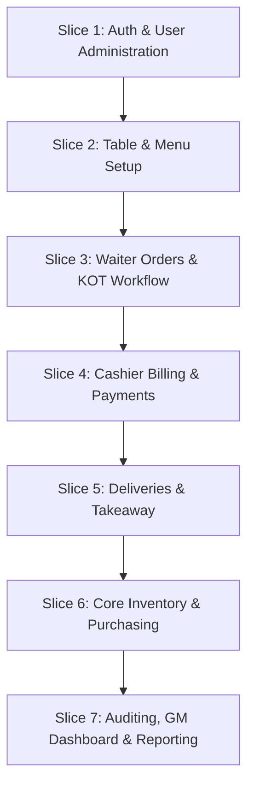

# LocalStorage to Backend Migration Strategy

This document details the transition plan for migrating the client-side state (currently managed in Redux Toolkit and persisted via `localStorage`) to the production Node.js + Fastify + PostgreSQL backend.

---

## 1. State Mapping: Client to Server

The current application relies on `saveState` and `loadState` in `frontend/src/services/persistence/localStorage.js` to serialize/deserialize all slices. In production, this mapping will transition:

| LocalStorage Slice / Key | Production State Type | Primary Target Table(s) | Derived State / Notes |
| :--- | :--- | :--- | :--- |
| `auth` | Session-Based Cookie | `users`, `user_sessions` | Frontend keeps `currentUser` profile in memory. Credentials and session tokens are stored on the server. |
| `restaurant` | Database Table | `restaurants`, `locations` | Fetched on application bootstrap. |
| `users` | Database Table | `users` | Managed via admin routes. |
| `tables` | Database Table | `tables` | Live status (Dine-in status) changes in real-time. |
| `menu` | Database Table | `menu_categories`, `menu_items` | Cached on initial load; refreshed on menu update event. |
| `orders` | Database Table | `orders`, `order_items` | Real-time write/read via APIs. |
| `kot` | Database Table | `kots`, `kot_items` | Real-time write/read via APIs. |
| `billing` | Database Table | `bills`, `bill_items` | Immutable financial ledger. |
| `payments` | Database Table | `payments` | Immutable payment ledger. |
| `customers` | Database Table | `customers` | Simple metadata tracking. |
| `delivery` | Database Table | `deliveries`, `delivery_status_history`| Status updates. |
| `notifications` | Database Table + WS | `notifications` | Real-time push; database stores unread alerts. |
| `audit` | Database Table | `audit_logs` | Write-only tracking. |
| `invItems`, `invStock` | Database Table | `inventory_items`, `stock` | Core inventory entities. |
| `purchaseOrders`, `grn` | Database Table | `purchase_orders`, `goods_receipts`| Operations tables. |
| `stockLedger` | Database Table | `stock_ledger` | Immutable ledger. |

---

## 2. API Integration Patterns & Error Handling

To transition Redux slices cleanly, we will replace the local synchronous reducers with asynchronous thunks (using Redux Toolkit's `createAsyncThunk` or RTK Query) to execute API requests.

### A. Loading States & UI Polish
- **Pattern:** Every Redux slice will include `loading`, `error`, and `success` status variables.
- **UI Element:** While `loading` is true, components must display skeleton loaders or centered spinner indicators.
- **Action:** Form submit buttons must disable and show loading indicators to prevent duplicate submissions.

### B. Error Handling & Recoverability
- **Validation Errors:** Fastify return HTTP 422 Unprocessable Entity for schema validation failures. The client will parse these and display field-level messages via `react-hook-form` / Zod.
- **Server Errors:** Return HTTP 500 or HTTP 502. The client will catch these and render general error alerts (using SweetAlert2 or Sonner toasts already in the project).
- **Network Interruptions:** Implement retry logic (e.g. exponential backoff for GET requests) and toast alerts asking the user to check their connection.

### C. Optimistic Updates
- **Usage:** Allowed only for low-risk, high-interactivity operations (e.g., toggling a notification as read, updating table statuses locally).
- **Rule:** If the backend rejects the action, the client must roll back the state to the previous value and display a warning toast.
- **Restriction:** Never use optimistic updates for financial operations (billing, payments, discounts), inventory adjustment confirmations, or order placements.

---

## 3. Concurrency & Data Synchronization

- **State Desynchronization:** Multiple users (e.g., Waiters and KOT Staff) interact with the same order simultaneously.
- **Solution:** 
  - The client will establish a WebSocket connection upon login.
  - When the server registers a critical status change (e.g., a KOT item marked as `READY`), it broadcasts a websocket update.
  - The client receives the payload and dispatches a local Redux update, triggering immediate UI re-rendering without page refreshes.
  - Polling fallback: If WebSocket connection drops, client falls back to calling status endpoints every 10 seconds.

---

## 4. Vertical Slice Migration Plan

To minimize deployment risk, the migration will proceed in vertical slices (database, API, and UI integration completed for one slice before moving to the next).

### Slice 1: Authentication & User Administration
- **Core Entities:** `users`, `user_sessions`.
- **Implementation:** Replace mock login page with HttpOnly cookie session setup. Allow users to log in, log out, and check their session profile.

### Slice 2: Table & Menu Setup
- **Core Entities:** `tables`, `menu_categories`, `menu_items`.
- **Implementation:** Migrate static configurations to PostgreSQL. Admin pages read and write menu settings directly from/to APIs.

### Slice 3: Waiter Orders & KOT Workflow
- **Core Entities:** `orders`, `order_items`, `kots`, `kot_items`.
- **Implementation:** Replace local order creation logic with calls to `POST /api/v1/orders`. KOT page pulls active tickets from the database.

### Slice 4: Cashier Billing & Payments
- **Core Entities:** `bills`, `bill_items`, `payments`.
- **Implementation:** Cashier bills and payment confirmations are persisted in PostgreSQL. Ensure calculations occur server-side.

### Slice 5: Deliveries & Takeaway
- **Core Entities:** `deliveries`, `delivery_status_history`.
- **Implementation:** Connect delivery workflows and delivery-boy views to the backend tables.

### Slice 6: Core Inventory & Purchasing
- **Core Entities:** `inventory_items`, `stock`, `stock_ledger`, `purchase_orders`, `goods_receipts`.
- **Implementation:** Connect stock ledger updates, GRN submissions, adjustments, issues, and transfers to server-side database actions.

### Slice 7: Auditing, GM Dashboard & Reporting
- **Core Entities:** `audit_logs`, `reimbursements`.
- **Implementation:** Enable dynamic query reporting for the GM commands, rendering historical logs and charts from PostgreSQL.
