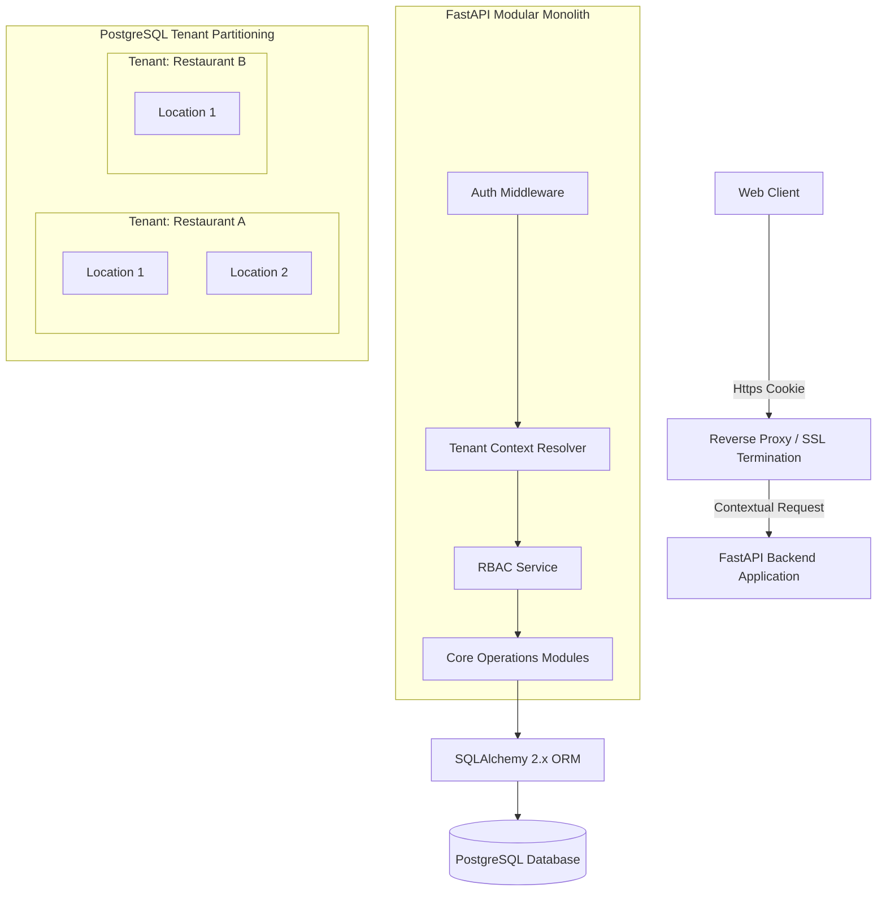
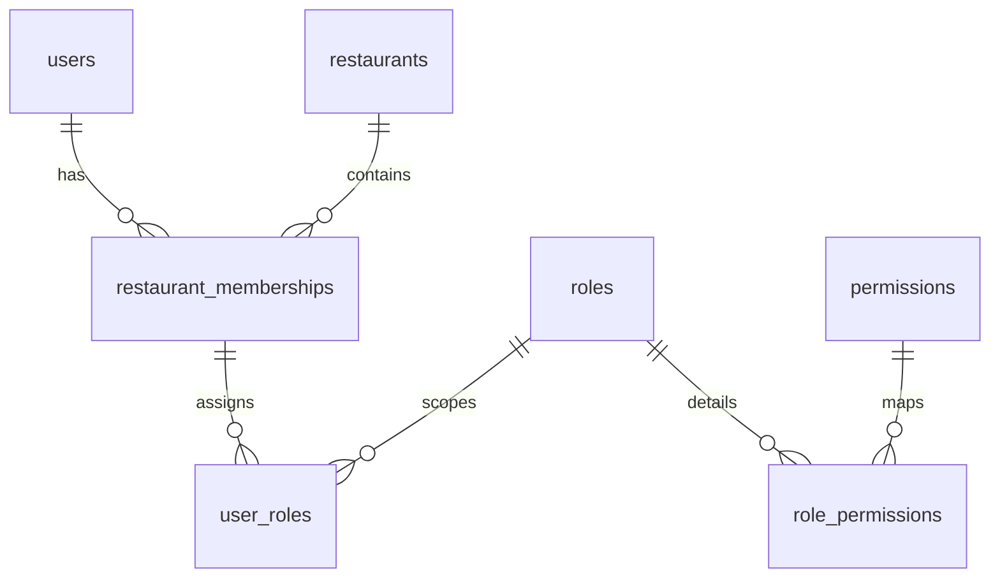
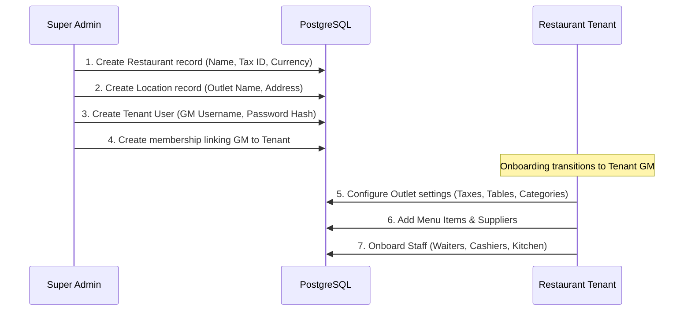

# Multi-Tenant SaaS Architecture

This document defines the production multi-tenant SaaS architecture for **Restaurant OS**. It establishes structural boundaries, security isolation, scoping, and data ownership models to support multiple independent restaurant brands (tenants) and outlets (locations) running on a single codebase and shared database infrastructure.

---

## 1. System Architecture Diagram

---

## 2. Tenant Hierarchy & Definitions

1. **PLATFORM (Global SaaS):** The overall infrastructure, code repository, hosting environment, and SaaS provider level.
2. **RESTAURANT (Tenant):** An independent business entity (e.g., "NS Resto Cafe", "Burger Corp"). Represents the primary tenant barrier. Data cannot cross this boundary under any circumstance.
3. **LOCATION (Outlet/Outlet Group):** A physical site operated by a tenant (e.g., "Coimbatore Main Outlet", "Erode Outlet"). A restaurant can have one or more locations.
4. **USER (Identity):** A physical person with login credentials (email/username + Argon2id hash). A user's identity is global to the platform, but their permissions are bound to specific restaurants and locations.
5. **ROLE (Membership Scope):** A set of operational permissions (e.g., `CASHIER`, `WAITER`, `INVENTORY_MANAGER`). Roles are scoped to a restaurant or location.
6. **PERMISSION (Action Grant):** Fine-grained permission tags (e.g., `order:create`, `bill:discount`, `menu:write`).

---

## 3. Data Ownership & Isolation Matrix

| Domain / Resource | Owner Scope | Tenant Isolated | Location Isolated |
| :--- | :--- | :--- | :--- |
| **Menu Categories & Items** | Restaurant | Yes | Optional (Location-specific override) |
| **Tables** | Location | Yes | Yes |
| **Orders & Order Items** | Location / User | Yes | Yes |
| **KOT & KOT Items** | Location | Yes | Yes |
| **Bills & Payments** | Location / Transaction | Yes | Yes |
| **Suppliers** | Restaurant | Yes | Yes |
| **Purchase Orders & GRNs** | Location | Yes | Yes |
| **Stock & Ledger** | Location | Yes | Yes |
| **Reimbursements** | Location | Yes | Yes |
| **Notifications** | User / Role / Loc | Yes | Yes |
| **Audit Logs** | Platform / Restaurant| Yes | Yes |

---

## 4. RBAC + Tenant Membership Model

A user can have memberships across multiple locations or restaurants with different roles.

### Table Schema Additions

#### `restaurant_memberships`
- `id` UUID PRIMARY KEY
- `user_id` UUID REFERENCES users(id) ON DELETE CASCADE
- `restaurant_id` UUID REFERENCES restaurants(id) ON DELETE CASCADE
- `status` VARCHAR(20) DEFAULT 'ACTIVE'

#### `user_roles`
- `id` UUID PRIMARY KEY
- `membership_id` UUID REFERENCES restaurant_memberships(id) ON DELETE CASCADE
- `location_id` UUID REFERENCES locations(id) NULL (If NULL, role applies to all locations of the restaurant)
- `role_id` UUID REFERENCES roles(id)

---

## 5. Location Access Model & Scopes

- **Single Location Scope (e.g., Waiters, Cashiers):**
  - Membership is bound to a single `location_id`.
  - The context resolver extracts the location ID from the user session and applies it to all queries.
- **Multi-Location Scope (e.g., Area Inventory Manager):**
  - Membership assigns multiple active `location_id` filters in the `user_roles` configuration.
  - The user can select their active location context from the top navigation in the UI, and requests will carry a verified active location context token on the backend.
- **All Locations / Restaurant-Wide Scope (e.g., Restaurant GM):**
  - The membership `location_id` is set to `NULL` (representing wildcard access).
  - The GM can query consolidated metrics across all locations belonging to their authorized `restaurant_id`.

---

## 6. Tenant & Location Security Isolation Rules

- **Zero-Trust Client Context:** The backend **never** trusts incoming client requests specifying `tenant_id`, `restaurant_id`, or `location_id` in headers or body parameters for authorization.
- **Context Derivation:** The backend session middleware extracts the authenticated `user_id` from the secure cookie, queries `restaurant_memberships` and `user_roles` to verify the user's active membership, and populates the request context (`request.state.tenant_id`, `request.state.location_id`).
- **SQL Query Interceptor (Enforcement):**
  - FastAPI dependency injection supplies a scoped SQLAlchemy database session.
  - The session uses query interception or automatic filter logic (e.g., SQLAlchemy's `with_loader_criteria` or global filters) to append:
    `WHERE tenant_id = request.state.tenant_id AND (location_id = request.state.location_id OR :is_restaurant_wide = true)`
  - If a resource does not exist under that tenant boundary, the API returns HTTP 404 to avoid exposing ID existence.

---

## 7. Database Tenancy Strategy Recommendation

### Recommendation: Shared Database + Shared Schema with PostgreSQL Row Level Security (RLS)
- **Why:** 
  - Lowest operational overhead: Single database migrations (Alembic) apply to all tenants simultaneously.
  - Highly cost-effective for start-up scale (no need to manage separate DB connection pools per tenant).
  - RLS acts as a security defense-in-depth layer directly in the database, preventing developers from accidentally omitting `tenant_id` filters in complex SQL queries.
- **How RLS is Enforced:**
  1. For every query execution, FastAPI checks out a connection from the pool and sets session parameters:
     - `SET LOCAL app.current_tenant_id = 'restaurant-uuid';`
     - `SET LOCAL app.current_location_id = 'location-uuid';` (For a location-scoped user) OR `SET LOCAL app.current_location_id = '';` (For a restaurant-wide GM)
     - `SET LOCAL app.current_user_role = 'role-name';`
  2. The table RLS policy evaluates these variables:
     - **Location-Scoped User Policy:**
       `USING (restaurant_id = NULLIF(current_setting('app.current_tenant_id', true), '')::uuid AND location_id = NULLIF(current_setting('app.current_location_id', true), '')::uuid)`
     - **Restaurant-Wide GM Policy (Location ID is NULL/Empty):**
       `USING (restaurant_id = NULLIF(current_setting('app.current_tenant_id', true), '')::uuid AND (NULLIF(current_setting('app.current_location_id', true), '') IS NULL AND current_setting('app.current_user_role', true) = 'GM'))`
  3. **Critical Security Invariant:** If `app.current_location_id` is empty, RLS **never** permits unrestricted access. It strictly enforces the active `app.current_tenant_id` and requires the active role to be `GM` or `SUPER_ADMIN`.
  4. Platform Super Admin uses a separate postgres role bypass policy (`BYPASSRLS`).

---

## 8. Multi-Location Inventory & Stock Transfers

To execute stock transfers across outlets securely:
1. **Validation Checks:**
   - Verify `source_location_id` and `destination_location_id` belong to the same authorized `restaurant_id`.
   - Verify `source_location_id != destination_location_id`.
   - Check that the executing user's role has the `inventory:transfer` permission.
   - Query stock balance of the source location and verify `quantity >= requested_transfer_quantity`.
2. **Atomic Execution:**
   - Execute both update operations (deduct source, increment destination) and stock ledger insertion inside a single SQL transaction block (`BEGIN ... COMMIT`).

---

## 9. Platform-Level Super Admin Scope

A Platform Super Admin operates outside the restaurant hierarchy and manages:
- Registration and onboarding of new restaurant brands.
- System-wide parameters (e.g., subscription tier pricing, core payment gateway routes).
- Feature flags (e.g., enabling or disabling the Delivery module globally).
- Access to raw system audit logs and diagnostic health metrics.
- *Constraint:* Restaurant GMs have absolutely no access to Platform Administration API routes.

---

## 10. Onboarding Flow Sequence

No code deployment, schema compilation, or repository cloning is required. Onboarding is a pure runtime data configuration flow.
