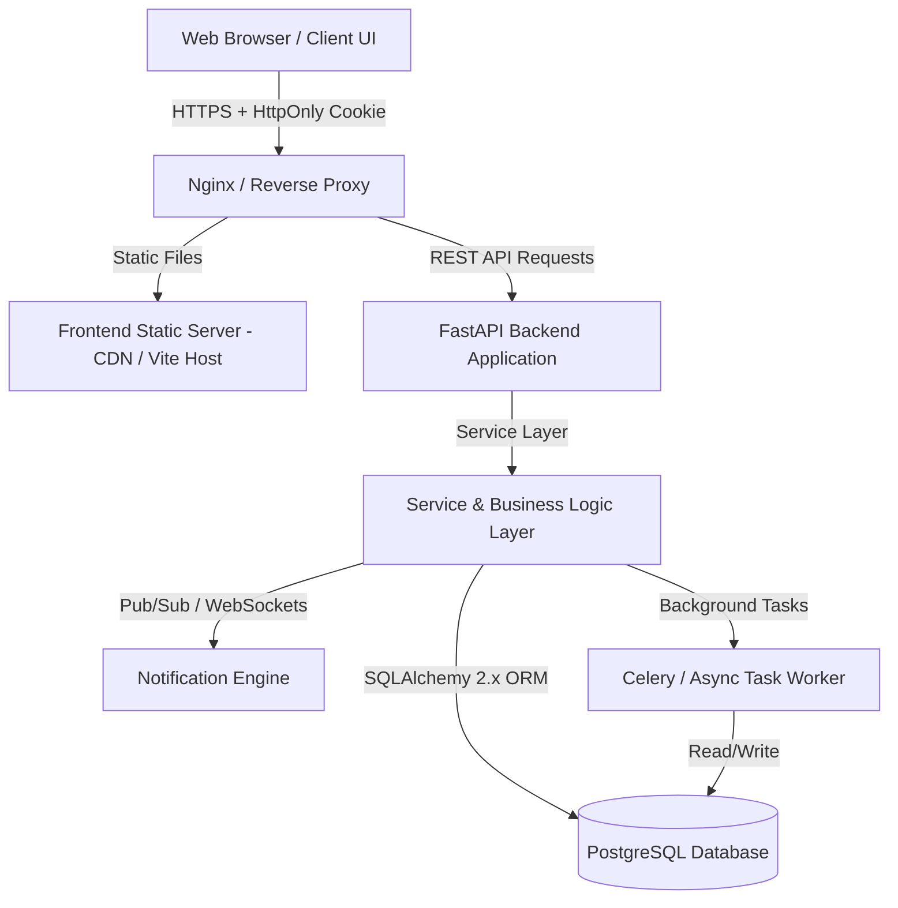

# Production System Architecture

This document defines the production system architecture for the **Restaurant Management System (Restaurant OS)**, mapping the transition from a client-side local-storage demonstration UI to a secure, multi-tenant enterprise system.

## 1. High-Level Architecture Overview

The system employs a classic decoupled tier architecture, enforcing clear separation of concerns:

- **Presentation Layer (Browser):** React + Redux Toolkit + Vite. Operates purely as a client interface. It fetches data dynamically, handles UI workflows, and maintains transient state, but is no longer the source of truth or persistence.
- **Reverse Proxy / Gateway:** Nginx handles SSL termination, CORS headers, security headers (HSTS, CSP, etc.), and routes requests either to the static web server or the backend API.
- **Application Layer (FastAPI Backend):** Provides high-performance async endpoint routing, input validation (Pydantic), and acts as the central business logic controller.
- **Service & Domain Layer:** Contain database transaction boundaries, validation rules, KOT engines, stock ledger adjustments, and notifications.
- **Database Layer (PostgreSQL):** The authoritative, ACID-compliant source of truth for all operational, menu, financial, and audit data.

---

## 2. Technology Stack & Justification

| Layer | Recommended Technology | Justification vs. Alternatives |
| :--- | :--- | :--- |
| **Frontend Runtime** | React (v19) + Vite | Already used by the current codebase; fast developer feedback cycle, small bundle size, and high render efficiency. |
| **Backend Framework** | FastAPI | High performance (async/ASGI native), auto-documentation (OpenAPI/Swagger), native Pydantic integration for payload parsing, and lightweight architecture matching Python's ecosystem. |
| **Database** | PostgreSQL (v16+) | Industry standard for transactional reliability (ACID), robust support for complex relations, check constraints, JSONB column indexing for dynamic payloads, and strong backup capabilities. |
| **ORM** | SQLAlchemy 2.x | Type-safe queries, session unit-of-work pattern, advanced relationship prefetching, and clear support for modern Python type hinting. |
| **Database Migrations**| Alembic | Auto-generation of migration scripts based on SQLAlchemy models, linear and branching version tracking, and seamless rollback execution. |
| **Authentication** | HttpOnly Secure Session Cookies | Restricts token storage (JWTs in LocalStorage are susceptible to XSS). Cookies with `Secure`, `HttpOnly`, and `SameSite=Strict` offer robust protection against CSRF and credential theft. |
| **Password Hashing** | Argon2id | OWASP-recommended hashing algorithm offering superior memory-hard resistance to brute force and GPU cracking compared to bcrypt. |
| **Payload Validation** | Pydantic v2 | Extremely fast parsing, type-safe serialization, and custom validator logic that perfectly bridges HTTP payloads and Python object layers. |

---

## 3. Core Architectural Modules

### A. Authentication & Session Management
- **Authentication Mechanism:** The system will use server-side sessions stored in a Redis or PostgreSQL database cache.
- **Session Tokens:** A random, cryptographically secure session ID is generated upon successful login.
- **Cookie Settings:** The session ID is set in the client's browser using a cookie with:
  - `HttpOnly`: Prevents client-side Javascript from reading the session token (protects against XSS).
  - `Secure`: Ensures the cookie is only transmitted over HTTPS connections.
  - `SameSite=Strict`: Mitigates Cross-Site Request Forgery (CSRF).
  - `Path=/api`: Restricts cookie transmission to API requests only.
- **Session Expiration:** Hard timeout set to 12 hours. Idle timeouts set to 2 hours of inactivity.

### B. Tenant & Location Isolation (Multi-Restaurant Architecture)
To support multiple locations/restaurants securely:
- **Tenant Scope:** Every record in tables requiring isolation (e.g., `orders`, `bills`, `stock`, `purchase_orders`, `users`) contains a `restaurant_id` and `location_id`.
- **Database Enforcement:** 
  - SQLAlchemy query intercepts automatically append `WHERE restaurant_id = :current_restaurant_id AND location_id = :current_location_id` filtering for operations except for Super Admin views.
  - Foreign keys strictly link resources to target restaurants to prevent cross-tenant referencing (BOLA/IDOR prevention).

### C. Financial Transactions & Immutability
- **Source of Truth:** PostgreSQL is the authoritative source for financial transactions (bills, payments, refunds).
- **Immutability Principle:** Once a `bill` or `payment` is written:
  - It **cannot** be modified directly or deleted. 
  - Any amendments or discount changes must register as a separate transaction type or a new versioned entry in the audit ledger.
  - Payments are mapped 1-to-1 or N-to-1 to bills using foreign keys, backed by database constraints preventing double payments.

### D. Inventory Calculations & Ledger
- **Stock Balances:** The `stock` table represents real-time quantity caches.
- **Immutable Stock Movement Ledger:** The `stock_ledger` is the immutable ledger tracking every addition (`STOCK_IN` from GRN, adjustments, transfers) and subtraction (`STOCK_OUT` for issues, waste, orders).
- **Consistence Enforcement:** Every stock modification updates the cache and registers a corresponding ledger entry in a single, atomic database transaction.

### E. Notification & Real-Time Event System
- **Real-Time Communication:** Fast-changing operational events (e.g., KOT ready, new bill request) are pushed to clients using **WebSockets** managed by FastAPI.
- **Fallback Mechanism:** Long-polling or client periodic pulls (managed by a server-driven version of `TimerEngine`) in case WebSocket connections degrade.
- **Sound Alerts & Modals:** Pushed dynamically via client action hooks matching the existing sound files and SweetAlert templates.

### F. Background Job Execution & Timer Engine
- **Timer Tasks:** Background tasks (e.g., KOT delay monitoring, automatic pickup escalation, expired session cleanup) are offloaded to a background worker system (e.g., FastAPI BackgroundTasks for simple loops, or Celery for production-grade scheduling).
- **State Evaluation:** The background worker queries PostgreSQL directly to evaluate orders and items in `READY` status, triggering notifications if thresholds are exceeded (replacing the React client-side check).

### G. Audit Logging
- **Immutability:** Write-only table `audit_logs` capturing user action type, entity, timestamp, IP, and changes.
- **Trigger Points:** Interceptors in SQLAlchemy (`before_insert`, `before_update`) automatically push audit records to this table, decoupling audit logging from application controllers.

---

## 4. Operational Readiness

### A. Backups
- **Strategy:** Daily automated snapshots using `pg_dump` with continuous archiving (Write-Ahead Logging) to an encrypted object store (e.g., AWS S3 with KMS).
- **Retention:** 30 days of daily backups, 12 months of monthly backups.

### B. Monitoring & Logging
- **Application Logs:** Structured JSON logs sent to standard output (Stdout) and forwarded to log aggregators (e.g., ELK Stack, Grafana Loki).
- **Error Tracking:** Native integration with Sentry to capture unhandled exceptions, database deadlock warnings, and API validation errors.
- **Metrics:** Prometheus exporter tracking endpoint latency, database pool connection count, and active WebSocket connections.
